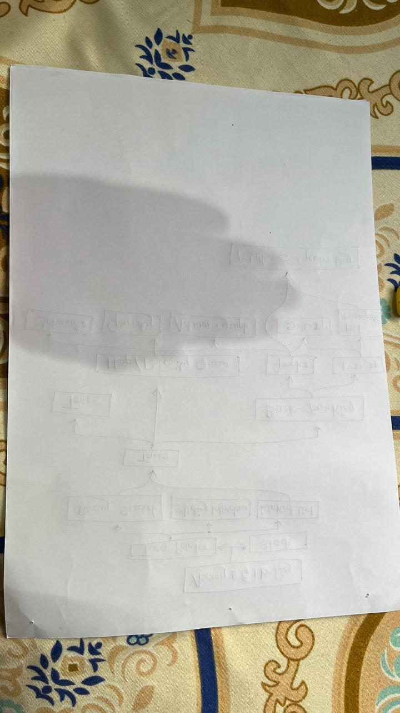
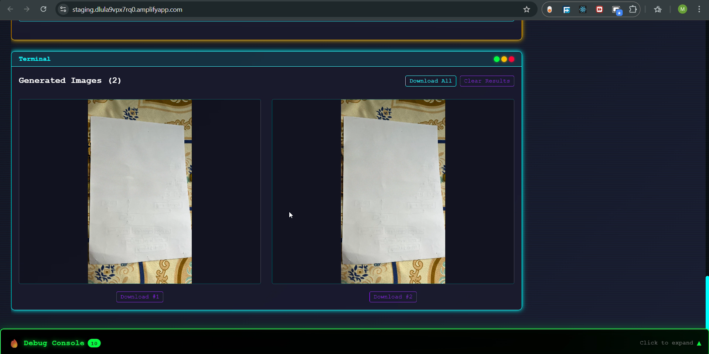

# 🎨 AWS Serverless Image Editing Application

A powerful, cloud-native image editing tool built with AWS services. Edit images with AI-powered inpainting and outpainting using Amazon Titan Image Generator v2.


---

## ✨ Features

- **AI-Powered Image Editing** - Uses Amazon Titan Image Generator v2 via AWS Bedrock
- **Inpainting & Outpainting** - Fill masked regions or extend image boundaries
- **Serverless Architecture** - Scales automatically with AWS Lambda
- **Real-time Processing** - Fast image generation with request tracking
- **Analytics & Logging** - DynamoDB integration for usage tracking and metrics
- **Secure Authentication** - AWS Cognito user management
- **CORS-Enabled API** - Safe cross-origin requests

---

## 📊 Application Example

### Planning to Production
**Before:** Architecture & Design Planning


**After:** Live Application with AI-Generated Results


The "before" image shows the initial planning phase with architecture sketches and design documentation. The "after" image demonstrates the completed serverless application running in production, showcasing AI-powered image generation using Amazon Bedrock's Titan model. The application successfully processes user uploads and generates two high-quality image variations through the Lambda function.

---

## 📂 Project Structure

```
AWS-Serverless-Image-Editor/
├── frontend/                    # React + Vite web app
│   ├── src/                     # React components
│   ├── config/                  # AWS configuration
│   └── index.html               # Entry point
├── backend/                     # AWS Lambda service
│   ├── src/
│   │   ├── lambda_function.py   # Main handler
│   │   ├── utils.py             # Utility functions
│   │   └── titan_handler.py     # Bedrock integration
│   ├── tests/                   # Unit tests
│   └── requirements.txt         # Python dependencies
├── README.md                    # Main docs
└── DEPLOYMENT.md                # Deployment guide
```

See [PROJECT_STRUCTURE.md](PROJECT_STRUCTURE.md) for complete directory layout.

---

## 🏗️ Architecture Overview

```
┌─────────────────────────────────────────────────────────┐
│                    Frontend (Vite + React)               │
│              Hosted on AWS Amplify Hosting               │
│  - Image upload & canvas editor                          │
│  - Mask creation interface                               │
│  - Real-time image preview                               │
└────────────────────┬────────────────────────────────────┘
                     │ HTTPS (with Cognito auth)
                     ▼
┌─────────────────────────────────────────────────────────┐
│              API Gateway (REST API)                      │
│              /image-edit → POST endpoint                │
└────────────────────┬────────────────────────────────────┘
                     │
                     ▼
┌─────────────────────────────────────────────────────────┐
│          AWS Lambda (Python)                             │
│  - Request validation & processing                       │
│  - Image parameter extraction                            │
│  - Bedrock API orchestration                             │
└────────────────────┬────────────────────────────────────┘
                     │
         ┌───────────┼───────────┐
         ▼           ▼           ▼
    ┌────────┐ ┌─────────┐ ┌──────────┐
    │ Bedrock│ │DynamoDB │ │CloudWatch│
    │(Titan) │ │(Logging)│ │ (Logs)   │
    └────────┘ └─────────┘ └──────────┘
```

---

## 🔧 AWS Services Used

| Service | Purpose | Details |
|---------|---------|---------|
| **AWS Amplify** | Hosting & Deployment | Serves static frontend assets (React + Vite) |
| **API Gateway** | REST API Endpoint | Routes `/image-edit` POST requests to Lambda |
| **AWS Lambda** | Compute & Orchestration | Python-based image processing handler |
| **Amazon Bedrock** | AI/ML | Titan Image Generator v2 for image synthesis |
| **Amazon Cognito** | Authentication | User sign-in & JWT authorization |
| **DynamoDB** | Logging & Analytics | Logs all requests with metrics & timing |
| **CloudWatch** | Monitoring | Logs, metrics, and debugging |
| **Amazon S3** | Storage | (Optional) Store generated images |

---

## 🚀 Getting Started

### Prerequisites
- AWS Account with appropriate permissions
- Node.js & npm
- AWS CLI configured

### Installation

1. **Clone the repository**
```bash
git clone https://github.com/your-username/aws-serverless-image-editor.git
cd aws-serverless-image-editor
```

2. **Install dependencies**
```bash
npm install
```

3. **Configure AWS Resources**
- Copy `config/config.example.js` to `config/config.js`
- Add your AWS resource IDs:
  ```javascript
  window._workshopConfig = {
    cognito: {
      userPoolId: 'your-pool-id',
      userPoolClientId: 'your-client-id',
      region: 'us-west-2'
    },
    api: {
      invokeUrl: 'https://your-api-gateway-url.amazonaws.com/prod'
    }
  };
  ```

4. **Deploy Frontend**
```bash
npm run build
# Upload dist/ folder to AWS Amplify
```

---
� Backend Implementation

The Lambda function is built with a modular Python structure for maintainability and testing:

### [Backend Documentation](backend/README.md)

Key modules:
- **lambda_function.py** - Main handler and request orchestration
- **utils.py** - CORS, base64 calculations, DynamoDB logging
- **titan_handler.py** - Bedrock model request formatting
- **tests/** - Comprehensive unit tests

All code includes detailed docstrings and error handling.

---

## �
## 📝 Lambda Function Specification

### Endpoint Details
- **Method:** POST
- **Path:** `/image-edit`
- **Authentication:** AWS Cognito

### Request Payload
```json
{
  "prompt": {
    "text": "a serene landscape with mountains",
    "mode": "OUTPAINTING"
  },
  "base_image": "data:image/png;base64,iVBORw0KGgo...",
  "mask": "data:image/png;base64,iVBORw0KGgo...",
  "model": "titan",
  "canvas_config": {}
}
```

### Response
```json
{
  "images": ["base64_image_1", "base64_image_2"],
  "model_used": "titan",
  "request_id": "uuid-string",
  "generation_time_ms": 2543
}
```

### Supported Modes
- `INPAINTING` - Fill masked regions with AI-generated content
- `OUTPAINTING` - Extend image boundaries
- `precise-outpaint` - High-precision outpainting mode

---

## 🔐 Lambda Function Features

### Error Handling
- Comprehensive input validation
- Detailed error messages with request tracking
- Graceful failure responses with request IDs

### Performance Monitoring
- Request timing (generation_time_ms)
- Input/output size calculations
- DynamoDB logging for analytics

### Request Tracking
- Unique request IDs for every invocation
- Complete audit trail in DynamoDB
- Success/failure logging

---

## 📊 DynamoDB Schema

```
Tabl� Quick Start

### Frontend Setup
```bash
# Install dependencies
npm install

# Start development server
npm run dev

# Build for production
npm run build
```

### Backend Setup
```bash
cd backend

# Install Python dependencies
pip install -r requirements.txt

# Run tests
make test

# Build Lambda package
make build

# Deploy to AWS Lambda
make deploy
```

---

## �e: ImageGenerationTable
├── id (PK): uuid
├── timestamp: ISO 8601 datetime
├── model_id: string
├── prompt: string (truncated to 1000 chars)
├── mode: string (INPAINTING, OUTPAINTING, etc.)
├── image_base64_size_bytes: number
├── mask_base64_size_bytes: number
├── output_images_size_bytes: number
├── generation_time_ms: number
├── success: boolean
└── error_message: string (if applicable)
```

---

## 🛠️ Development

See [DEPLOYMENT.md](DEPLOYMENT.md) for complete step-by-step instructions.

### Quick Deploy Summary

**1. Create AWS Resources**
```bash
# DynamoDB table, IAM role, Lambda function, API Gateway, Cognito
# See DEPLOYMENT.md for detailed AWS CLI commands
```

**2. Deploy Backend**
```bash
cd backend
make build deploy
```

**3. Configure Frontend**
```bash
# Update config/config.js with your AWS resource IDs
cp config/config.example.js config/config.js
# Edit with your values:
# - Cognito User Pool ID
# - Cognito App Client ID  
# - API Gateway Invoke URL
```

**4. Deploy Frontend**
```bash
npm run build
# Upload dist/ to AWS Amplify

## 📈 Performance Metrics

- **Average Response Time:** 2-4 seconds
- **Supported Image Sizes:** Up to 1024x1024px
- **Output Resolution:** 1024x1024px (Premium quality)
- **Concurrent Requests:** Auto-scales with Lambda

---

## 🔒 Security

- **CORS Policy:** Configured for safe cross-origin requests
- **Content Security Policy:** Restricts resource loading
- **Authentication:** AWS Cognito protects API endpoints
- **Input Validation:** Strict validation of all parameters
- **Base64 Encoding:** Images encoded for safe transmission

---

```bash
# Check Lambda logs
aws logs tail /aws/lambda/image-editor-lambda --follow

# Verify Bedrock access
aws bedrock describe-foundation-models --region us-west-2

# Test Lambda directly
aws lambda invoke --function-name image-editor-lambda response.json
```

### Authentication Errors
- Verify Cognito User Pool configuration in AWS Console
- Check Client ID in `config/config.js` matches AWS
- Ensure CORS headers are properly set in API Gateway

### APDocumentation

**Project Docs:**
- [DEPLOYMENT.md](DEPLOYMENT.md) - Complete AWS deployment guide
- [PROJECT_STRUCTURE.md](PROJECT_STRUCTURE.md) - Directory layout
- [backend/README.md](backend/README.md) - Lambda function documentation

**AWS Resources:**
- [AWS Bedrock Documentation](https://docs.aws.amazon.com/bedrock/)
- [Amazon Titan Image Generator](https://aws.amazon.com/bedrock/titan/)
- [AWS Lambda Developer Guide](https://docs.aws.amazon.com/lambda/)
- [AWS Amplify Hosting](https://aws.amazon.com/amplify/hosting/)
- [Cognito User Authentication](https://docs.aws.amazon.com/cognito/)
- [DynamoDB Developer Guide](https://docs.aws.amazon.com/dynamodb/)
- [API Gateway REST API](https://docs.aws.amazon.com/apigateway
- Verify table exists: `aws dynamodb describe-table --table-name ImageGenerationTable`
- Check Lambda IAM role has `dynamodb:PutItem` permission
- Review Lambda error logs for DynamoDB exceptions
### 2. Deploy Frontend
```bash
# Build optimized bundle
npm run build

# Deploy to Amplify
aws amplify start-deployment \
  --app-id your-app-id \
  --branch-name main
```

### 3. Configure Environment Variables
Set Lambda environment variables:
```
DYNAMODB_TABLE_NAME=ImageGenerationTable
AWS_REGION=us-west-2
```

---

## 🐛 Troubleshooting

### Images Not Generating
- Check Lambda CloudWatch logs: `aws logs tail /aws/lambda/image-editor-lambda --follow`
- Verify Bedrock model access in your region
- Confirm base64 image encoding

### Authentication Errors
- Verify Cognito User Pool configuration
- Check Client ID matches config.js
- Ensure CORS headers are properly set

### API Gateway Issues
- Check API Gateway CloudWatch logs
- Verify Lambda execution role has Bedrock permissions
- Test endpoint with curl/Postman

---

## 📚 Resources

- [AWS Bedrock Documentation](https://docs.aws.amazon.com/bedrock/)
- [Amazon Titan Image Generator](https://aws.amazon.com/bedrock/titan/)
- [AWS Lambda Developer Guide](https://docs.aws.amazon.com/lambda/)
- [AWS Amplify Hosting](https://aws.amazon.com/amplify/hosting/)
- [Cognito User Authentication](https://docs.aws.amazon.com/cognito/)

---

## 📄 License

This project is licensed under the MIT License - see the LICENSE file for details.

---

## 🤝 Contributing

Contributions are welcome! Please feel free to submit a Pull Request.

1. Fork the repository
2. Create your feature branch (`git checkout -b feature/AmazingFeature`)
3. Commit your changes (`git commit -m 'Add some AmazingFeature'`)
4. Push to the branch (`git push origin feature/AmazingFeature`)
5. Open a Pull Request

---

## 👤 Author

Built with ❤️ as a demonstration of serverless image editing with AWS services.

---

**⭐ If this project helped you, please consider giving it a star!**
